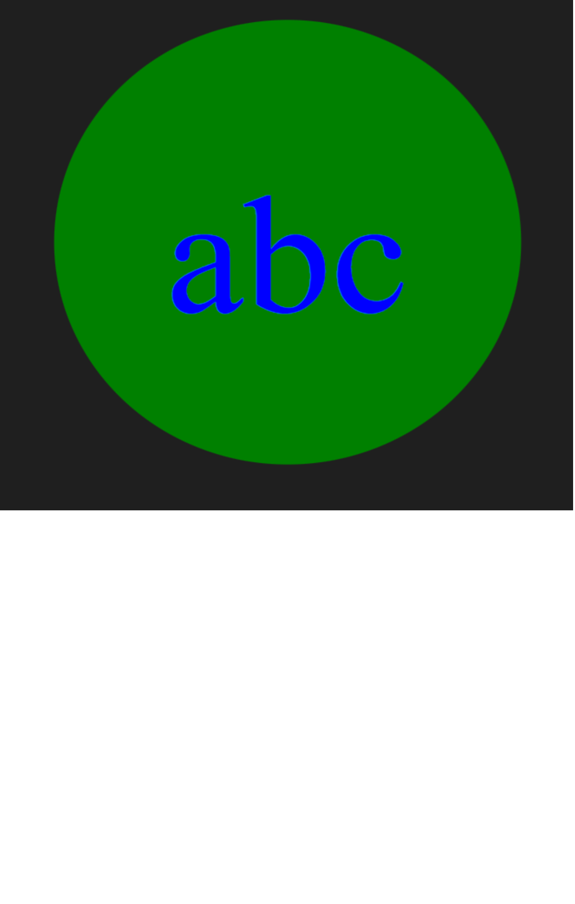

# SVG Logo Generator

## Create Command Line Application

- When prompted for characters User can input up to 3 characters long.
- User asked to enter a text color.
- User asked to choose a shape from list of triangle, circle, square.
- User asked to enter a background color.
- When user has entered input for all of the prompt a `logo.svg` file is created.
- The output `"Generated logo.svg"` is displayed in the command line
- When user opens `logo.svg` file in a browser:
- - Then user is shown a 300x200 pixel image of the logo they created.

## Usage

```bash
node index.js
```

## Installation

```bash
npm install
```
## Sample SVG



## Video

- https://drive.google.com/file/d/1RNEwMVnRoMJjtLtJ-RW_z083b_DkWooz/view
